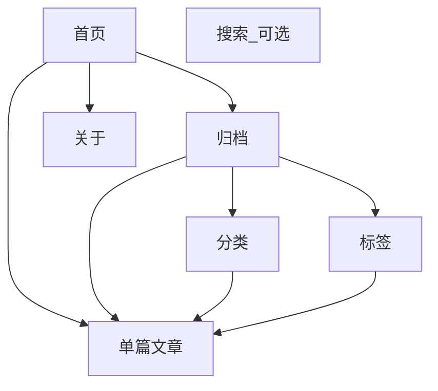

# 受众与站点地图（设计决策）

## 受众与内容策略（首版假设）

| 维度 | 决策 | 说明 |
|------|------|------|
| 语言 | **中文为主**，英文标题/摘要可选 | 正文以中文易读性优先；导航与元信息双语可在后续迭代 |
| 评论 | **首版不提供** | 降低运营与审核成本；外链至讨论区或邮件可作为替代 |
| 订阅 | **RSS + 可选邮件块** | 设计预留 Newsletter 模块，上线可先仅 RSS |
| 付费 / 会员 | **首版无** | 无付费墙；全文公开 |

若与你的产品不符，只需改本页表格并在 `02-wireframes.md` 中增减对应模块。

## 站点地图（最终 IA）

### 页面职责

- **首页**：一句话定位、最新/精选文章列表、主导航。
- **归档**：时间序列表；筛选入口链向分类/标签页。
- **分类 / 标签**：与归档共用列表布局，仅页眉与数据源不同。
- **单篇**：长文阅读、元信息、相关阅读或上一篇/下一篇。
- **关于**：简介、写作方向、社交与联系。
- **搜索**：可选；首版可在导航中预留入口或省略。

### URL 结构（实际实现）

本项目使用静态 HTML + Express 静态文件服务，URL 结构如下：

- `/` 或 `/index.html` — 首页  
- `/archive.html` — 归档（支持 `?tag=xxx`、`?category=xxx`、`?q=xxx` 筛选）  
- `/post.html?slug=<slug>` — 单篇文章  
- `/about.html` — 关于  
- `/links.html` — 外部链接  
- `/components.html` — 组件索引页  

API 接口（RESTful）：
- `/api/posts`、`/api/posts/:slug`
- `/api/tags`、`/api/categories`
- `/api/links`

> 注意：文档最初设计建议使用 clean URL（如 `/posts/:slug`），但实际实现采用静态 HTML 文件 + query 参数方式。

---

*下一步：见 [02-wireframes.md](02-wireframes.md) 线框说明；交互原型见上级目录 `index.html` 等页面。*
