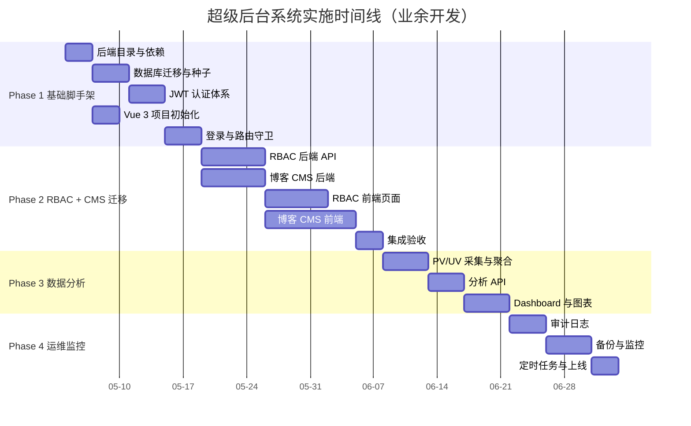
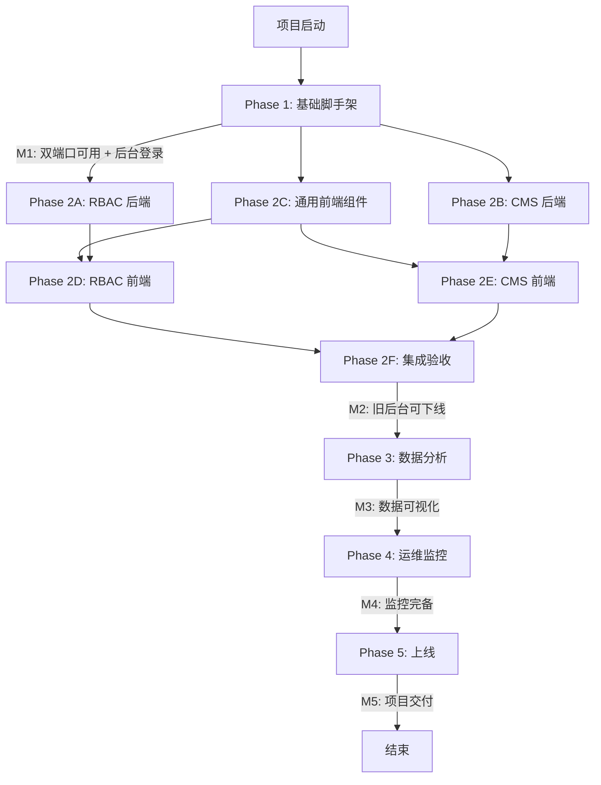

# 超级后台系统 — 项目实施计划

> 版本：v1.0 | 日期：2026/05/02
> 关联文档：[`04-admin-architecture.md`](./04-admin-architecture.md) — 架构设计
> 工作节奏：业余开发（晚上 + 周末），预计每周 10 小时有效开发时间
> 总工期：约 12 周（不含 Phase 5 可选扩展）

---

## 1. 项目概述

### 1.1 目标
基于现有博客系统，建设统一的超级管理后台，前端采用 Vue 3 SPA、后端 Express 模块化重构、数据库继续使用 SQLite。前后台通过不同端口物理隔离（前台 8787 / 后台 3000）。

### 1.2 范围

**In Scope（本期实施）**
- Phase 1～4 的全部交付物
- 双端口服务架构落地
- JWT + RBAC 多用户权限体系
- 博客 CMS 全部功能从 EJS 迁移到 Vue 3
- 数据分析与运维监控的基础框架

**Out of Scope（不在本期）**
- Phase 5（多站点扩展）作为可选项，按需启动
- 第三方 OAuth 登录（GitHub / Google 等）
- 移动端 App
- 实时消息推送（WebSocket）
- 全文搜索引擎接入（Meilisearch / ES）

### 1.3 关键约束
- 不影响现有博客线上服务（`ifoxchen.com`）
- 现有 EJS 管理后台在迁移完成前持续可用
- 单人开发，业余时间，需要避免大块连续依赖任务

---

## 2. 整体时间线

---

## 3. 里程碑清单

| 里程碑 | 描述 | 预计完成 | 验收标准 |
|--------|------|---------|---------|
| **M1** | 双端口服务跑通 + 后台登录可用 | Week 2 末 | 8787 / 3000 都能访问，后台登录后看到空白 Dashboard |
| **M2** | 新后台可完全替代旧 EJS 后台 | Week 6 末 | 所有博客管理操作（文章/标签/分类/友链/上传）在新后台完成 |
| **M3** | 数据分析模块上线 | Week 8 末 | Dashboard 可看到 PV/UV、文章统计图表 |
| **M4** | 运维监控模块上线 | Week 10 末 | 操作有审计日志、可手动备份、可看系统状态 |
| **M5** | 项目正式上线 + 旧 EJS 后台下线 | Week 12 末 | 生产环境跑稳、文档齐全、Nginx 配置生效 |

---

## 4. Phase 1：基础脚手架（Week 1-2，预计 16-20 小时）

**目标**：搭建双端口后端服务、JWT 认证、Vue 3 SPA 骨架，完成登录闭环。

### 4.1 任务清单

| ID | 任务 | 类型 | 依赖 | 估时 (小时) | 验收标准 |
|----|------|------|------|------|---------|
| **T1.1** | 创建后端新目录：`middleware/`、`apps/`、`modules/`、`jobs/` | 后端 | — | 0.5 | 目录存在，README 占位 |
| **T1.2** | 安装新依赖：`jsonwebtoken`、`cors`、`joi`、`winston`、`node-cron` | 后端 | T1.1 | 0.5 | `package.json` 更新，`npm install` 通过 |
| **T1.3** | 数据库迁移：新增 `users`、`roles`、`permissions`、`role_permissions`、`user_roles`、`menus`、`audit_logs`、`front_users`、`page_views`、`sites` 表 | 后端 | T1.1 | 2 | 启动 server 表自动建立、可在 sqlite CLI 查询 |
| **T1.4** | 数据库种子：超级管理员账号（从 `.env` 迁移）、3 个基础角色、12 个基础权限、默认菜单 | 后端 | T1.3 | 1.5 | 首次启动后用 `ADMIN_EMAIL/ADMIN_PASSWORD` 可登录 v2 |
| **T1.5** | 拆分 `apps/frontApp.js`，迁移现有所有路由（公共 API + 旧 admin EJS + 旧 admin API） | 后端 | T1.1 | 2 | 8787 端口启动后所有现有功能正常 |
| **T1.6** | 创建 `apps/adminApp.js`，挂载 v2 路由前缀 | 后端 | T1.1 | 1 | 3000 端口启动，访问 `/health` 返回 ok |
| **T1.7** | 改造 `src/index.js` 实现双端口同进程启动 | 后端 | T1.5, T1.6 | 1 | `npm run dev` 同时打印两个端口的访问地址 |
| **T1.8** | 实现 `middleware/cors.js`（仅开发环境生效） | 后端 | T1.6 | 0.5 | 开发环境 5173 / 8787 可跨域访问 3000 |
| **T1.9** | 实现 `middleware/jwtAuth.js`（accessToken 校验、挂载 `req.user`） | 后端 | T1.4 | 1.5 | 单元测试：无 token 401，过期 token 401，有效 token 通过 |
| **T1.10** | 实现 `middleware/rbac.js`（`requirePermission(code)` 工厂函数） | 后端 | T1.9 | 1 | 超管直接放行，普通用户检查权限码 |
| **T1.11** | 实现 `/api/v2/auth/login` —— bcrypt 校验、签发 access + refresh | 后端 | T1.4 | 1.5 | Postman 调用返回 token 与用户信息 |
| **T1.12** | 实现 `/api/v2/auth/refresh` —— refresh token 校验与续期 | 后端 | T1.11 | 1 | refresh 返回新 accessToken |
| **T1.13** | 实现 `/api/v2/auth/logout`、`/me`、`/menus` | 后端 | T1.11 | 1 | `/menus` 根据当前用户角色返回菜单树 |
| **T1.14** | 初始化 `admin/` 目录：Vue 3 + Vite + TypeScript 模板 | 前端 | — | 1 | `npm run dev` 启动 5173 端口看到默认页 |
| **T1.15** | 配置 Naive UI、Tailwind CSS、Pinia、Vue Router 4 | 前端 | T1.14 | 1.5 | 引入测试组件可正常渲染 |
| **T1.16** | 配置 `vite.config.ts` —— 代理 `/api` 到 `localhost:3000` | 前端 | T1.14 | 0.5 | 前端发出的 `/api/*` 请求被代理 |
| **T1.17** | 实现 `api/request.ts` —— Axios 实例、请求/响应拦截器、token 注入、401 自动续期 | 前端 | T1.16 | 1.5 | 401 时自动调用 refresh 重试一次 |
| **T1.18** | 实现 `stores/auth.ts`（token、用户信息、登录/登出 action） | 前端 | T1.17 | 1 | login/logout 后状态正确切换 |
| **T1.19** | 实现 `stores/permission.ts`（菜单树、权限码集合） | 前端 | T1.18 | 1 | 登录后从 `/auth/menus` 拉取并存储 |
| **T1.20** | 实现 `views/login/index.vue` —— 登录表单 + 错误提示 | 前端 | T1.18 | 1.5 | 输入正确密码进入后台、错误提示明确 |
| **T1.21** | 实现路由 + 路由守卫（未登录跳 login，已登录访问 login 跳 dashboard） | 前端 | T1.18, T1.19 | 1.5 | URL 直接访问 `/cms/posts` 未登录会跳登录页 |
| **T1.22** | 实现 `components/layout/AdminLayout.vue` —— 顶栏 + 侧边栏 + 主区域 | 前端 | T1.19 | 2 | 侧边栏按用户菜单渲染，可折叠 |
| **T1.23** | 实现 `views/dashboard/index.vue` —— 占位欢迎页 | 前端 | T1.22 | 0.5 | 登录后看到 "欢迎 XXX" |
| **T1.24** | 实现 `directives/permission.ts` —— `v-permission="'post:delete'"` 控制按钮显隐 | 前端 | T1.19 | 1 | 无权限的按钮不渲染 |
| **T1.25** | 集成验收：双端口启动、登录、菜单加载、Dashboard 显示 | 集成 | All above | 1 | 录制一段 GIF 演示完整流程 |
| **T1.26** | 文档：更新 `CLAUDE.md`、`README.md` 的开发启动方式 | 文档 | T1.25 | 1 | 新人按文档可在 5 分钟内启动 |

**Phase 1 合计**：约 28 小时（业余 ~3 周）

### 4.2 Phase 1 验收 Checklist
- [ ] `cd server && npm run dev` 同时启动 8787 + 3000 两个端口
- [ ] 访问 `http://localhost:8787` 看到现有博客前台
- [ ] 访问 `http://localhost:8787/admin/login` 旧 EJS 登录可用
- [ ] 访问 `http://localhost:5173` Vue dev server 启动
- [ ] Vue 后台登录页输入超管账号 → 跳转 Dashboard
- [ ] 浏览器 DevTools 看到 `Authorization: Bearer xxx` 请求头
- [ ] accessToken 过期后自动调用 refresh 续期
- [ ] 数据库 `users` 表中存在超管账号

---

## 5. Phase 2：RBAC + 博客 CMS 迁移（Week 3-6，预计 40-50 小时）

**目标**：完整的 RBAC 管理界面 + 现有博客功能在新后台全部可用，可以下线 EJS 后台。

### 5.1 任务清单

#### 5.1.1 RBAC 后端

| ID | 任务 | 类型 | 依赖 | 估时 (小时) | 验收标准 |
|----|------|------|------|------|---------|
| **T2.1** | 用户管理 API —— 列表（搜索/分页）、详情、创建、更新、删除、重置密码 | 后端 | M1 | 4 | Postman 全跑通，密码返回前端不含明文 |
| **T2.2** | 用户分配角色 API —— `PUT /users/:id/roles` | 后端 | T2.1 | 1 | 一次提交可全量替换用户角色 |
| **T2.3** | 角色管理 API —— CRUD + 列表 | 后端 | M1 | 3 | 角色 code 唯一校验、删除前检查是否被引用 |
| **T2.4** | 角色分配权限 API —— `PUT /roles/:id/permissions` | 后端 | T2.3 | 1 | 提交后该角色的用户权限实时刷新 |
| **T2.5** | 权限管理 API —— 列表（按 resource 分组）+ 编辑（仅 name/description） | 后端 | M1 | 2 | 不允许直接增删 code（系统级） |
| **T2.6** | 菜单管理 API —— 树形列表、CRUD、拖拽排序 | 后端 | M1 | 4 | 排序保存后 `/auth/menus` 返回顺序一致 |
| **T2.7** | 审计日志中间件 —— 自动捕获所有写操作（POST/PUT/DELETE）写入 `audit_logs` | 后端 | M1 | 3 | 每次操作记录 user_id、action、resource、ip、ua |

#### 5.1.2 博客 CMS 后端（迁移到 v2）

| ID | 任务 | 类型 | 依赖 | 估时 (小时) | 验收标准 |
|----|------|------|------|------|---------|
| **T2.8** | 文章 CRUD API（v2） —— 列表（含分页/搜索/筛选/排序）、详情、创建、更新、删除 | 后端 | M1 | 4 | 字段、错误码与旧 API 等价 |
| **T2.9** | 文章发布/下架 API（v2） | 后端 | T2.8 | 1 | 状态切换、`publishedAt` 自动更新 |
| **T2.10** | 标签管理 API（v2） —— CRUD + 文章数统计 | 后端 | M1 | 2 | 删除标签时自动解除文章关联 |
| **T2.11** | 分类管理 API（v2） —— CRUD + 文章数统计 | 后端 | M1 | 2 | 同上 |
| **T2.12** | 友链管理 API（v2） —— CRUD + 拖拽排序 | 后端 | M1 | 2 | sortOrder 字段持久化 |
| **T2.13** | 文件上传 API（v2） —— `/api/v2/admin/cms/upload` | 后端 | M1 | 1 | 复用现有 multer 配置，权限改为 `media:upload` |
| **T2.14** | 数据导出 API（v2） —— 兼容旧格式 | 后端 | M1 | 1 | 导出文件可用 v2 导入还原 |
| **T2.15** | 数据导入 API（v2） —— 兼容旧格式 | 后端 | T2.14 | 1.5 | 支持旧版本备份文件 |

#### 5.1.3 通用前端组件

| ID | 任务 | 类型 | 依赖 | 估时 (小时) | 验收标准 |
|----|------|------|------|------|---------|
| **T2.16** | `components/common/PageHeader.vue` —— 页面顶部标题 + 操作按钮 | 前端 | M1 | 1 | 标题、面包屑、按钮槽位 |
| **T2.17** | `components/common/DataTable.vue` —— 通用表格（搜索、分页、批量、排序） | 前端 | M1 | 4 | 接受 columns 配置、API 函数，统一加载状态 |
| **T2.18** | `components/common/FormDrawer.vue` —— 通用右侧抽屉表单 | 前端 | M1 | 2 | 创建/编辑共用一个抽屉 |
| **T2.19** | `components/common/MarkdownEditor.vue` —— 封装 Markdown 编辑器（Vditor / Bytemd 选其一） | 前端 | M1 | 3 | 支持图片粘贴上传、预览、源码切换 |
| **T2.20** | `components/common/ImageUploader.vue` —— 单/多图上传组件 | 前端 | T2.13 | 1.5 | 拖拽上传、进度条、删除 |
| **T2.21** | `composables/useTable.ts` —— 表格数据获取与分页通用 hook | 前端 | T2.17 | 1.5 | 切换搜索条件自动刷新 |

#### 5.1.4 RBAC 前端

| ID | 任务 | 类型 | 依赖 | 估时 (小时) | 验收标准 |
|----|------|------|------|------|---------|
| **T2.22** | 用户管理页 —— 列表 + 增删改 + 重置密码 + 分配角色 | 前端 | T2.1, T2.2, T2.17 | 4 | 全功能跑通，密码字段隐藏 |
| **T2.23** | 角色管理页 —— 列表 + CRUD + 分配权限（树形勾选） | 前端 | T2.3, T2.4 | 3 | 权限按 resource 分组展示 |
| **T2.24** | 权限管理页 —— 列表（只读为主） | 前端 | T2.5 | 1.5 | 列表 + 编辑名称/描述 |
| **T2.25** | 菜单管理页 —— 树形列表 + 拖拽排序 + CRUD | 前端 | T2.6 | 3 | 拖拽后保存接口调用成功 |

#### 5.1.5 博客 CMS 前端

| ID | 任务 | 类型 | 依赖 | 估时 (小时) | 验收标准 |
|----|------|------|------|------|---------|
| **T2.26** | 文章列表页 —— 表格 + 状态筛选 + 搜索 + 分类筛选 + 批量操作 | 前端 | T2.8, T2.17 | 3 | 与旧 EJS 后台功能等价 |
| **T2.27** | 文章新建/编辑页 —— Markdown 编辑器 + 元信息表单 + 标签/分类选择 + 封面上传 + 保存草稿/发布 | 前端 | T2.8, T2.19, T2.20 | 5 | 草稿与发布两种状态切换 |
| **T2.28** | 标签管理页 —— 列表 + 增删改 + 文章数显示 | 前端 | T2.10 | 1.5 | 删除前提示影响范围 |
| **T2.29** | 分类管理页 —— 列表 + 增删改 + 文章数显示 | 前端 | T2.11 | 1.5 | 同上 |
| **T2.30** | 友链管理页 —— 列表 + 增删改 + 拖拽排序 + 图标预览 | 前端 | T2.12 | 2 | 图标可见、排序生效 |
| **T2.31** | 媒体库页 —— 已上传图片列表 + 复制链接 + 删除 | 前端 | T2.13 | 2 | 网格展示 + 搜索 + 操作 |
| **T2.32** | 数据导入导出页 —— 一键导出 + 文件上传导入 | 前端 | T2.14, T2.15 | 1.5 | 导入前预览数据条数 |

#### 5.1.6 集成与验收

| ID | 任务 | 类型 | 依赖 | 估时 (小时) | 验收标准 |
|----|------|------|------|------|---------|
| **T2.33** | 端到端验收：登录 → 创建用户 → 分配角色 → 创建文章 → 发布 → 前台查看 | 集成 | All above | 1.5 | 录屏 GIF |
| **T2.34** | 旧后台对照测试：所有旧 EJS 功能在新后台均有对应实现 | 集成 | All above | 1.5 | 列出对照清单逐项验证 |
| **T2.35** | 文档：用户使用手册（用户/角色/文章操作） | 文档 | T2.33 | 2 | Markdown 文档配截图 |

**Phase 2 合计**：约 65 小时（业余 ~7 周，但有些任务可并行）

> **并行优化建议**：T2.1～T2.7（RBAC 后端）与 T2.8～T2.15（CMS 后端）可在不同晚上交替推进，避免单一类型疲劳。

### 5.2 Phase 2 验收 Checklist
- [ ] 通过新后台完成一篇文章的完整生命周期（创建→保存→发布→修改→下架→删除）
- [ ] 创建一个新用户，分配"内容编辑"角色，登录后只能看到文章/标签/分类菜单
- [ ] 创建一个新角色，赋予部分权限，分配给用户验证按钮级权限
- [ ] 上传 5 张图片，在媒体库可见，可复制链接到文章
- [ ] 旧 EJS 后台 `/admin/posts` 与新 `/cms/posts` 数据完全一致
- [ ] 数据导出 → 清空数据库 → 导入还原，数据无损
- [ ] 所有写操作在 `audit_logs` 表能查到记录

---

## 6. Phase 3：数据分析框架（Week 7-8，预计 14-18 小时）

**目标**：博客访问数据采集、聚合、可视化展示。

### 6.1 任务清单

#### 6.1.1 后端

| ID | 任务 | 类型 | 依赖 | 估时 (小时) | 验收标准 |
|----|------|------|------|------|---------|
| **T3.1** | PV/UV 上报 API —— `POST /api/track`（无需认证，限流） | 后端 | M2 | 1.5 | 频率限制 60 次/分钟/IP |
| **T3.2** | 字段：path、referrer、ip、user_agent、session_id（前端生成）写入 `page_views` | 后端 | T3.1 | 1 | 每次访问写入一条记录 |
| **T3.3** | Dashboard 概览 API —— 总文章数、总评论数（预留为 0）、今日 PV/UV、最近 7 天趋势 | 后端 | T3.2 | 2 | 单次请求返回 5-10 个核心指标 |
| **T3.4** | 流量趋势 API —— 按天/小时聚合 PV/UV，支持时间范围参数 | 后端 | T3.2 | 2 | 返回 7/30/90 天的时序数据 |
| **T3.5** | 内容分析 API —— 文章热度 Top 10、分类/标签分布 | 后端 | T3.2 | 2 | 各维度排行榜 |
| **T3.6** | 实时统计 API（预留） —— 当前在线人数（基于最近 5 分钟有上报的 session_id 数） | 后端 | T3.2 | 1 | 返回单一数字 |
| **T3.7** | 定时聚合任务 —— 每天凌晨聚合昨日数据到 `daily_stats` 表（节省查询） | 后端 | T3.2 | 2 | cron 任务正常运行 |

#### 6.1.2 前台埋点

| ID | 任务 | 类型 | 依赖 | 估时 (小时) | 验收标准 |
|----|------|------|------|------|---------|
| **T3.8** | 在 `js/blog.js` 中添加 `track()` 函数，页面加载时调用 | 前端 (旧站) | T3.1 | 1 | 翻页/刷新都能触发 |
| **T3.9** | session_id 通过 sessionStorage 维持，UV 通过 localStorage 持久化 | 前端 (旧站) | T3.8 | 0.5 | 同一浏览器不重复算 UV |

#### 6.1.3 后台前端

| ID | 任务 | 类型 | 依赖 | 估时 (小时) | 验收标准 |
|----|------|------|------|------|---------|
| **T3.10** | 升级 Dashboard：核心指标卡片（4-6 个）+ 最近 7 天趋势小图 | 前端 | T3.3 | 2 | 数据准确，图表流畅 |
| **T3.11** | 流量分析页 —— ECharts 折线图（PV/UV）+ 时间范围切换（7/30/90 天） | 前端 | T3.4 | 2.5 | 切换时间无明显卡顿 |
| **T3.12** | 内容分析页 —— 热门文章柱状图 Top 10 + 分类/标签饼图 | 前端 | T3.5 | 2 | 点击柱子跳转文章详情 |
| **T3.13** | 实时面板（卡片）—— 在 Dashboard 显示当前在线 | 前端 | T3.6 | 0.5 | 30 秒自动刷新 |

**Phase 3 合计**：约 20 小时（业余 ~2 周）

### 6.2 Phase 3 验收 Checklist
- [ ] 在博客前台浏览 5 篇文章，`page_views` 表有对应记录
- [ ] Dashboard 数字与 SQLite 直接查询结果一致
- [ ] 流量趋势图切换 7/30/90 天数据正确
- [ ] 热门文章排行与实际访问量一致
- [ ] 定时聚合任务每天 03:00 自动执行（Docker 容器中也生效）

---

## 7. Phase 4：运维监控框架（Week 9-10，预计 12-16 小时）

**目标**：操作可追溯、数据可备份、系统状态可观测。

### 7.1 任务清单

#### 7.1.1 后端

| ID | 任务 | 类型 | 依赖 | 估时 (小时) | 验收标准 |
|----|------|------|------|------|---------|
| **T4.1** | 审计日志查询 API —— 列表（多条件筛选：用户、动作、资源、时间）、详情 | 后端 | M2 | 2.5 | 支持按用户/资源/时间范围筛选 |
| **T4.2** | SQLite 备份脚本 —— 调用 `VACUUM INTO`，输出 `server/backups/{timestamp}.sqlite` | 后端 | M2 | 1.5 | 不锁库、文件可恢复 |
| **T4.3** | 备份列表 API —— 列出 `server/backups/` 中的文件 + 大小 + 时间 | 后端 | T4.2 | 1 | 按时间倒序 |
| **T4.4** | 手动触发备份 API + 备份下载 API | 后端 | T4.2 | 1.5 | 下载需 ops:backup 权限 |
| **T4.5** | 备份清理策略 —— 保留最近 30 个，旧的自动删除 | 后端 | T4.4 | 1 | 配置项可调 |
| **T4.6** | 系统监控 API —— Node 进程状态、CPU、内存、磁盘、SQLite 文件大小 | 后端 | M2 | 2 | Linux 环境通过 `os` 模块读取 |
| **T4.7** | 自动备份定时任务（cron 表达式可配置） | 后端 | T4.2 | 1 | 默认每天 03:00 |
| **T4.8** | 旧审计日志清理任务（保留 90 天） | 后端 | T4.1 | 0.5 | 可配置保留天数 |

#### 7.1.2 后台前端

| ID | 任务 | 类型 | 依赖 | 估时 (小时) | 验收标准 |
|----|------|------|------|------|---------|
| **T4.9** | 审计日志查询页 —— 表格 + 时间范围 + 用户筛选 + 操作类型筛选 + 详情抽屉 | 前端 | T4.1 | 3 | 翻页流畅、详情清晰 |
| **T4.10** | 备份管理页 —— 列表 + 立即备份按钮 + 下载 + 状态提示 | 前端 | T4.3, T4.4 | 2 | 备份过程有 loading |
| **T4.11** | 系统监控看板 —— 仪表盘式展示 CPU/内存/磁盘/数据库大小 + 自动刷新 | 前端 | T4.6 | 2 | 30 秒刷新一次 |

**Phase 4 合计**：约 18 小时（业余 ~2 周）

### 7.2 Phase 4 验收 Checklist
- [x] 用任意用户做任意写操作，在审计日志页都能查到
- [x] 手动触发备份，文件出现在 `server/backups/`
- [x] 下载备份文件，本地用 `sqlite3` 打开数据完整
- [x] 自动备份在凌晨 02:00 触发（cron 注册成功）
- [x] 监控页显示的内存/磁盘数字与系统实际一致
- [x] 审计日志清理任务保留 90 天（`AUDIT_LOG_RETENTION_DAYS` 可配置）

---

## 8. Phase 5：上线 + 旧系统下线（Week 11-12，预计 8-12 小时）

**目标**：生产环境部署、Nginx 配置、监控告警、旧 EJS 后台优雅下线。

### 8.1 任务清单

| ID | 任务 | 类型 | 依赖 | 估时 (小时) | 验收标准 |
|----|------|------|------|------|---------|
| **T5.1** | 修改 `Dockerfile`：增加 Vue 3 SPA 构建步骤、暴露双端口 | DevOps | M4 | 1.5 | `docker build` 一次性产出可用镜像 |
| **T5.2** | 修改 `docker-compose.yml`：映射 8787 + 3000 端口、卷持久化 `backups/` | DevOps | T5.1 | 0.5 | 容器重启后备份不丢 |
| **T5.3** | Nginx 配置：`/admin/*` + `/api/v2/*` 反代到 3000 | DevOps | T5.1 | 1 | `nginx -t` 通过 |
| **T5.4** | 灰度发布：先在 192.168.3.100 部署测试、生产前观察 24 小时 | DevOps | T5.3 | 0.5 | 内网访问无异常 |
| **T5.5** | 生产数据备份 —— 上线前手动备份现有 `blog.sqlite` | DevOps | T5.4 | 0.5 | 备份文件本地保存一份 |
| **T5.6** | 部署 `deploy.sh` 升级版本 | DevOps | T5.4 | 1 | 一条命令完成部署 |
| **T5.7** | 监控验证：登录新后台、查看 PV、查看监控、查看审计 | 验收 | T5.6 | 0.5 | 全部正常 |
| **T5.8** | 旧 EJS 后台 —— 在 nav 加入"已迁移到新后台"提示，保留 1 个月作为兜底 | 后端 | T5.7 | 1 | 提示明显、链接到新后台 |
| **T5.9** | 文档：部署手册、应急回滚指南、用户手册整合发布 | 文档 | T5.7 | 2 | 三份文档齐全 |
| **T5.10** | 1 周后正式下线 EJS 后台 —— 注释 EJS 路由 | 后端 | T5.8 | 0.5 | `/admin/posts` 等返回 404 或重定向 |

**Phase 5 合计**：约 9 小时（业余 ~1-2 周）

### 8.2 上线验收 Checklist
- [ ] 浏览器访问 `https://ifoxchen.com` 博客正常
- [ ] 浏览器访问 `https://ifoxchen.com/admin` 进入 Vue 后台登录页
- [ ] 在新后台完成一次完整文章发布流程
- [ ] PV/UV 在 Dashboard 实时增加
- [ ] 凌晨 03:00 自动备份成功（次日检查）
- [ ] Nginx 日志无异常 4xx/5xx 飙升

---

## 9. Phase 6：多站点扩展（可选，按需启动）

> 本阶段为未来扩展预留，本期不实施。详细任务见 `docs/04-admin-architecture.md` 9.1 节 Phase 5。

简要任务：
- T6.1 `sites` 表迁移、`posts/external_links` 增加 `site_id`
- T6.2 v2 API 增加 `?siteId=xxx` 参数
- T6.3 站点管理 CRUD API
- T6.4 后台增加站点切换器
- T6.5 站点管理页

---

## 10. 任务依赖关系图

---

## 11. 风险登记册

| 风险 ID | 风险描述 | 影响 | 概率 | 应对措施 |
|---------|---------|------|------|---------|
| R1 | 双端口同进程下 SQLite 写入并发冲突 | 中 | 低 | 已启用 WAL 模式；写操作集中在后台进程，前台只读为主 |
| R2 | JWT 密钥泄露导致 token 伪造 | 高 | 低 | `.env` 不入库、密钥强度 ≥ 64 位、定期轮换；部署时单独管理 |
| R3 | Vue SPA 构建产物体积过大影响首屏 | 低 | 中 | 路由懒加载、组件按需加载、Vite production build |
| R4 | 业余时间不足导致 12 周计划延期 | 中 | 中 | 每个 Phase 之间预留 1 周缓冲；M2 是关键，前 6 周必须完成 |
| R5 | 旧后台与新后台数据不一致 | 高 | 低 | 共享同一 SQLite，新旧后台对同一表的更改即时生效 |
| R6 | Markdown 编辑器图片粘贴上传失败 | 中 | 中 | 选用成熟库（Vditor），调用 `/api/v2/admin/cms/upload` |
| R7 | 生产部署时 Nginx 配置导致前后台不可访问 | 高 | 低 | 灰度先在 192.168.3.100 验证、保留旧 Nginx 配置随时回滚 |
| R8 | 数据库迁移失败导致旧数据丢失 | 高 | 低 | 上线前手动备份；迁移使用 `CREATE TABLE IF NOT EXISTS`，不删旧表 |
| R9 | 用户角色配置错误导致超管丢失权限 | 高 | 低 | 数据库初始化时硬编码超管账号 `is_super_admin = 1`，跳过 RBAC 校验 |
| R10 | RBAC 设计过度复杂导致性能问题 | 中 | 低 | 用户权限在登录时缓存到 JWT，避免每次查库 |

---

## 12. 质量门禁

每个 Phase 通过的最低标准：

| 检查项 | 通过条件 |
|--------|---------|
| **功能完整性** | Phase Checklist 全部勾选 |
| **手工测试** | 关键路径完整跑通（登录、CRUD、权限、上传） |
| **回归测试** | 旧 8787 端口的所有 API 响应字段不变（保留兼容） |
| **代码质量** | 无 TODO 留待下一阶段；关键模块有 JSDoc 注释 |
| **文档同步** | 新功能在 `CLAUDE.md` 或 `docs/` 中有说明 |
| **安全检查** | 无明文密码、无 SQL 拼接、helmet 头开启 |
| **数据备份** | Phase 上线前手动备份一次数据库 |

> 单人项目无 CR 流程，但每个 Phase 结束自我 Review：
> 1. 看一遍所有改动 git diff
> 2. 跑一遍验收 Checklist
> 3. 在 `CHANGELOG.md` 记录关键变更

---

## 13. 跟踪与回顾节奏

### 13.1 周节奏（业余开发）
- **周一晚上**：Review 上周进度，规划本周 2-3 个核心任务
- **周二/周三/周四晚上**：每晚 1.5-2 小时推进
- **周末**（周六/周日）：每天 3-4 小时集中冲刺
- **周日晚上**：更新 Issues 状态、提交本周代码、写一段周记

### 13.2 Phase 节奏
- **每个 Phase 启动**：在 `CHANGELOG.md` 写下 Phase 目标
- **每个 Phase 结束**：跑完整 Checklist，截图存档，写一段总结
- **每个 Phase 之间预留 1 周缓冲**，应对临时事务或返工

### 13.3 GitHub Issues 使用
所有任务对应 GitHub Issue，标签体系：
- `phase-1` / `phase-2` / `phase-3` / `phase-4` / `phase-5`
- `backend` / `frontend` / `devops` / `docs` / `verify`
- `priority-high` / `priority-normal` / `priority-low`
- `blocked` / `in-progress` / `done`

Issues 模板见：[`05a-github-issues-template.md`](./05a-github-issues-template.md)

---

## 14. 交付物清单

完成本期项目后，应交付的全部产物：

### 14.1 代码与配置
- [ ] `server/src/apps/frontApp.js`、`adminApp.js`、`index.js` 双端口架构
- [ ] `server/src/middleware/` 全套中间件
- [ ] `server/src/modules/` 五大模块（core、blog、rbac、analytics、ops）
- [ ] `server/src/jobs/` 定时任务
- [ ] `admin/` 完整 Vue 3 SPA 代码
- [ ] `Dockerfile`、`docker-compose.yml`、`deploy.sh` 更新版本
- [ ] Nginx 配置示例 `nginx-blog.conf`

### 14.2 文档
- [ ] `docs/04-admin-architecture.md`（已交付）
- [ ] `docs/05-implementation-plan.md`（本文档）
- [ ] `docs/05a-github-issues-template.md` —— GitHub Issues 批量模板
- [ ] `docs/06-deployment-guide.md` —— 部署手册（Phase 5 产出）
- [ ] `docs/07-user-manual.md` —— 用户使用手册（Phase 2 产出）
- [ ] `docs/08-api-reference.md` —— API 文档（持续更新）
- [ ] `docs/09-rollback-runbook.md` —— 应急回滚指南（Phase 5 产出）
- [ ] `CLAUDE.md`、`README.md` 更新

### 14.3 数据
- [ ] 上线前 `blog.sqlite` 完整备份
- [ ] 上线后第一次自动备份
- [ ] 数据库初始化种子（默认权限、菜单）

---

## 15. 后续路线

完成本期后的中长期演进方向：

1. **多站点 CMS**：纳入第二个站点（如个人作品集 portfolio）做实际测试
2. **第三方登录**：GitHub / Google OAuth 集成（仅后台）
3. **评论系统**：基于 `front_users` 表的读者评论（前台）
4. **全文搜索**：接入 Meilisearch 替代 LIKE 查询
5. **WebSocket 实时通知**：备份完成、新评论、系统告警实时推送
6. **AI 辅助创作**：集成 Claude API 做文章摘要、SEO 优化建议
7. **国际化（i18n）**：后台支持中英文切换

---

**总结**：本计划共 **95 个核心任务**，预计 **127 小时业余开发时间**，分布在 **12 周**。每个 Phase 都有可独立交付的成果，避免长期挂起的烂尾分支。

**配套交付**：
- 完整任务清单 + 验收标准 → 见本文档
- GitHub Issues 批量模板 → 见 [`05a-github-issues-template.md`](./05a-github-issues-template.md)
- 任务分布：Phase 1 (26) + Phase 2 (35) + Phase 3 (13) + Phase 4 (11) + Phase 5 (10) = 95
